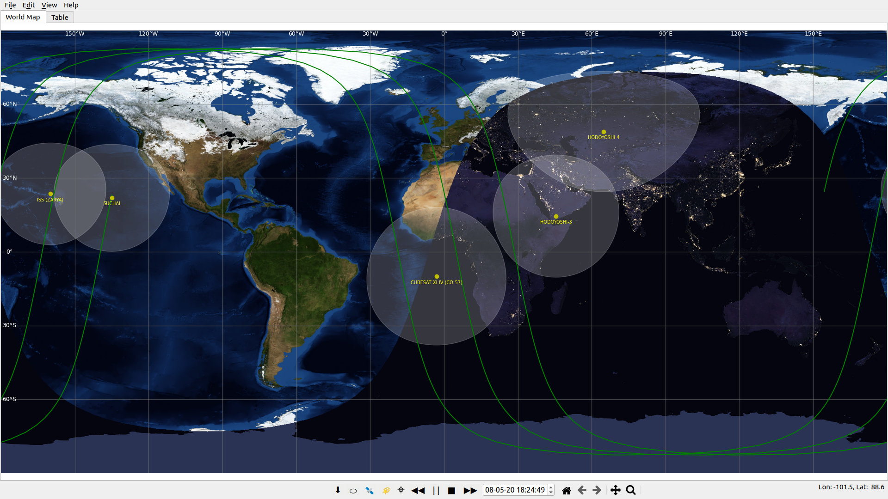

# Pypredict

[](https://github.com/spel-uchile/Pypredict/releases)
[](https://www.gnu.org/licenses/gpl-3.0.en.html)

This software is a real-time satellite tracker and orbit propagator. It displays any satellite's position and orbital parameters in real time. It can also simulate satellite deployments of one satellite from another with different velocities, considering the mass of the satellites. It is inspired by [Gpredict](https://github.com/csete/gpredict) and [Orbitron](http://www.stoff.pl/).

### Features

The following are some of the key features of Pypredict:

* Updates TLE data from [CelesTrak](https://www.celestrak.com/NORAD/elements/).
* Displays the satellites in real time.
* The user can open any TLE data from a txt file.
* The TLE data of the displayed satellites can be saved into a new TLE file.
* The satellites' coverage can be added or removed.
* It can show the South Atlantic Anomaly (SAA).
* The time and date can be changed, speed up forward, backwards and paused.
* Simulates deployments of one satellite from another and changes their TLEs according to their mass and the deployment speed velocity.
* Displays the names, categories, position and orbital parameters in a table.
* [Day](https://visibleearth.nasa.gov/images/73751/july-blue-marble-next-generation-w-topography-and-bathymetry) and [night](https://visibleearth.nasa.gov/images/144898/earth-at-night-black-marble-2016-color-maps) background images from [NASA](https://www.nasa.gov/).

Current version: 3.3.0



## Dependencies

The following are the current dependencies:

* [cartopy 0.17 or later](https://github.com/SciTools/cartopy)
* [cython 0.28 or later](https://github.com/cython/cython)
* [Fiona 1.8.13.post1 or later](https://github.com/Toblerity/Fiona)
* [geos 0.2.2 or later](https://github.com/grst/geos)
* [matplotlib 3.2.1 or later](https://github.com/matplotlib/matplotlib)
* [numpy 1.18.2 or later](https://github.com/numpy/numpy)
* [Pillow 7.1.1 or later](https://github.com/python-pillow/Pillow)
* [pykdtree 1.3.1 or later](https://github.com/storpipfugl/pykdtree)
* [pymongo 3.10.1 or later](https://github.com/mongodb/mongo-python-driver)
* [pyorbital 1.5 or later](https://github.com/pytroll/pyorbital)
* [PyQt5 5.14 or later](https://pypi.org/project/PyQt5/)
* [pyshp 1.1.4 or later](https://github.com/GeospatialPython/pyshp)
* [sgp4 2.7 or later](https://github.com/brandon-rhodes/python-sgp4)
* [shapely 1.5.6 or later](https://github.com/simplegeo/shapely)

## Supported software

* [Python 3.6 or later](https://www.python.org/downloads/)
* [Ubuntu 19.10](https://ubuntu.com/download/desktop) or later
* [Zorin OS Lite 15.2](https://zorinos.com/download/) or later
* [Raspbian Buster](https://www.raspberrypi.org/downloads/raspbian/) or later.

## Installation

### Instructions for GNU/Linux:

For Raspbian (Raspberry Pi) you may need to install this first:
```bash
sudo apt-get install python3-cairocffi
sudo apt-get install libatlas-base-dev
```

After this, the rest is the same for all GNU/linux based systems.

1. Install dependencies:
```bash
sudo sh install.sh
pip3 install --upgrade pip
```
2. Clone this repository:
```bash
git clone https://github.com/spel-uchile/Pypredict.git
```
3. Move to the Pypredict folder:
```bash
cd Pypredict/
```
4. Install Pypredict:
```bash
pip3 install . --no-binary shapely
```

### Instructions for Windows (untested):

1. Download and install [Python](https://www.python.org/downloads/).

2. Install dependencies using a [miniconda prompt](https://docs.conda.io/en/latest/miniconda.html):
```bash
conda install -c conda-forge proj
conda install -c conda-forge proj-data
```
3. Download this repository into your computer.

4. Open a command prompt (cmd), move to the directory of the downloaded repository and install Pypredict using pip:
```bash
pip3 install . --no-binary shapely
```

### Instructions for macOS (untested):

1. Install dependencies:
```bash
brew install proj geos
```
2. Clone this repository:
```bash
git clone https://github.com/spel-uchile/Pypredict.git
```
3. Move to the Pypredict folder:
```bash
cd Pypredict/
```
4. Install Pypredict:
```bash
pip3 install . --no-binary shapely
```


## Usage

You can search "Pypredict" on your application window, or you can run the following command:
```bash
python3 -m pypredict
```

## Contact

* Name: Matías Vidal Valladares
* e-mail: matias.vidal.v@gmail.com
